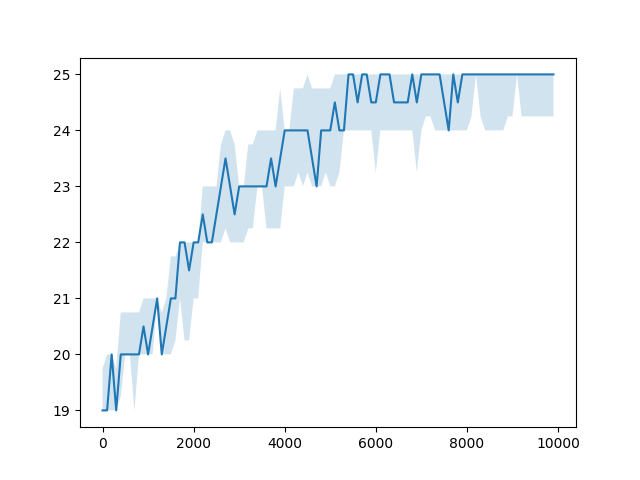
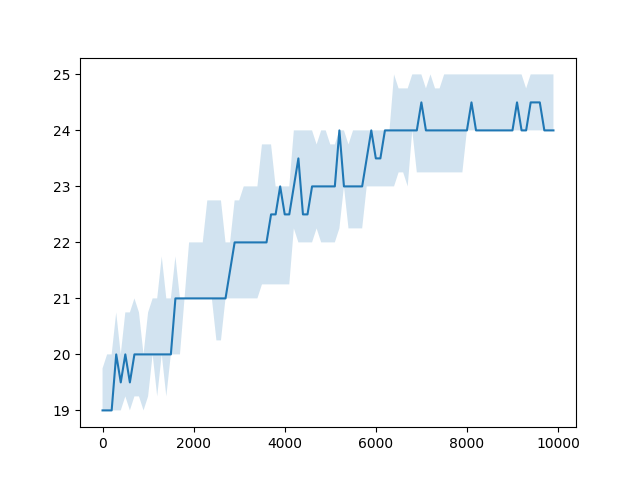
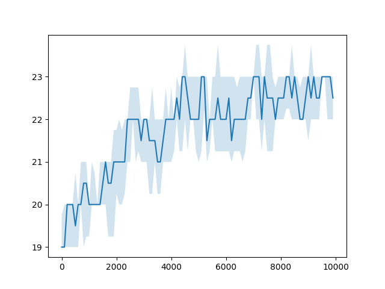

# HW 1 - Simple Genetic algorithm - Alternating individual
Author: **Roman Kaňa**

## Task definition
The task is to implement a simple genetic algorithm for acheiving an individual with alternating 1s and 0s.

## Changes in the given template (sga.py)

- Slighlty adjusted the [parameters](#crossover-and-mutation-probabilities)
- Changed the [fitness function](#fitness-function)

### Crossover and mutation probabilities
Since I enabled elitism, I have set the cross-over probability to 0.9 to explore a bit more, while lowering the mutation probability to 0.025 to prevent losing the better individuals to non-beneficial mutations.
The probability is set to `1/IND_LEN` so approximately at least one bit is flipped in each mutated individual.

```python
POP_SIZE = 100
GEN_COUNT = 100
IND_LEN = 25
CX_PROB = 0.9
MUT_PROB = 0.025
MUT_FLIP_PROB = 1 / IND_LEN
```

Lowering the `cross-over probability` to `0.5` does not seem to search the space of solutions well enough since the mean fitness does not reach the maximum value. So the one-point cross-over is still uninformed (not a smart operator) but seems to work quite well.

### Fitness function
As fitness function I have chosen the number of similar bits to to a target individual as follows:

```python
ZERO_START_IND = [ x % 2 for x in range(IND_LEN)]

def fitness(individual):
    return max(comparison := sum([int(individual_value == target_value) for individual_value, target_value in zip(individual, ZERO_START_IND)]), \
               IND_LEN - comparison)
```

> You can compute the similarity to the second target individual ( starting with 1 ) by taking the length of the individual and substracting the similarity to the first target individual, thanks to the fact that values are just 0s and 1s.

> I just thought that the second fitness function would not work quite as well (number of alternating pairs).

## Observations

 - **Higher mutation probability** is not beneficial since the mutation is not smart and can easily flip the wrong bits.
 - **Cross-over probability of 1** is not beneficial since the algorithm will loose most of the good individuals and lower the mean fitness.

## Plots
Best result, lower cross-over probability, higher mutation probability:\



