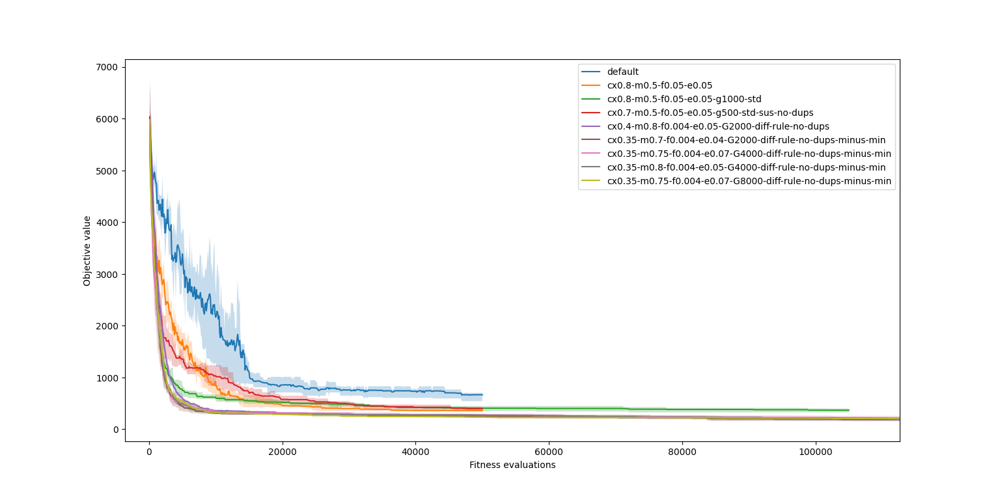
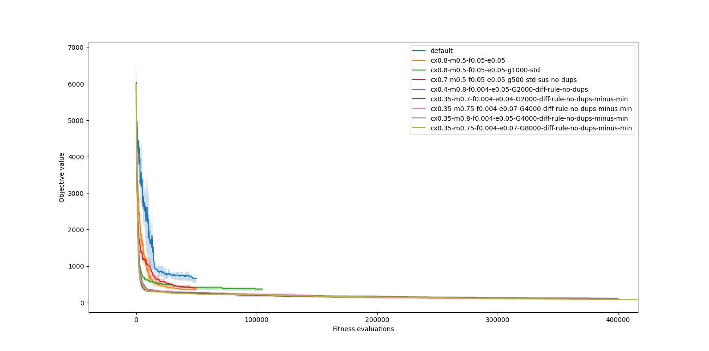
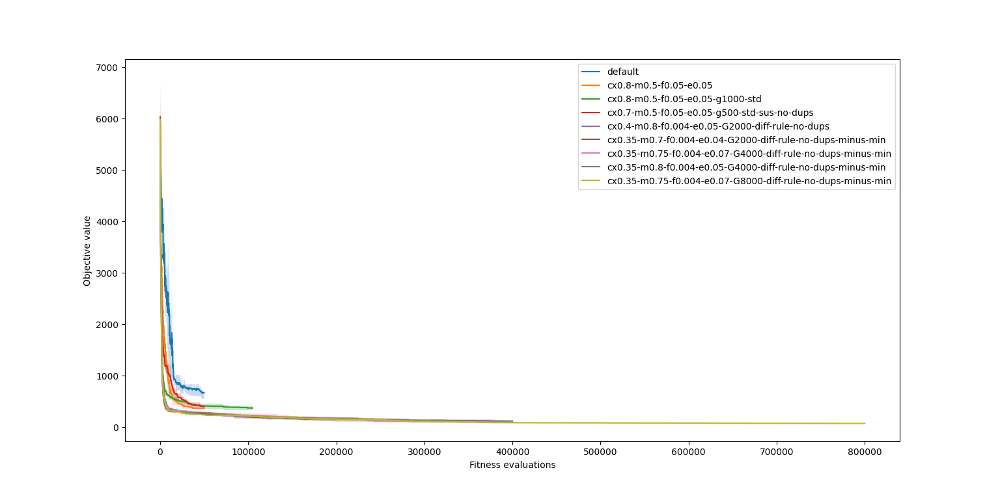
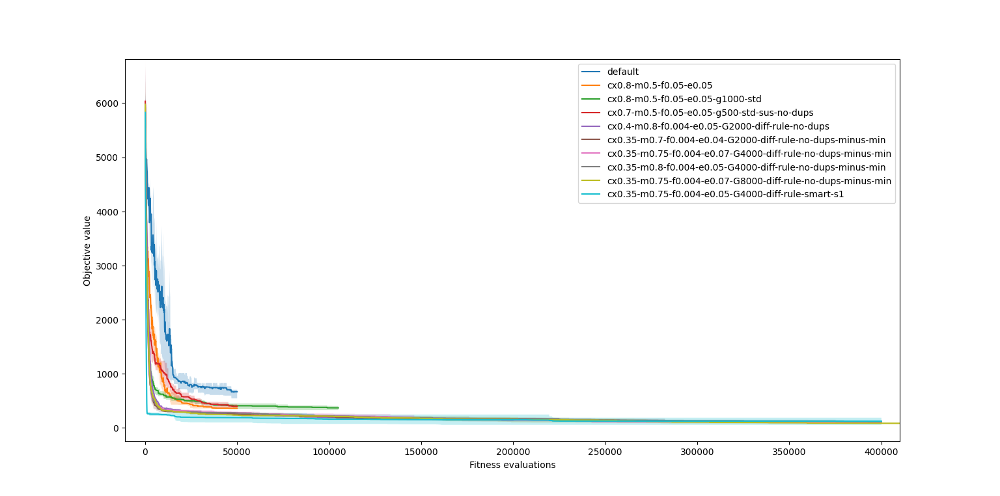
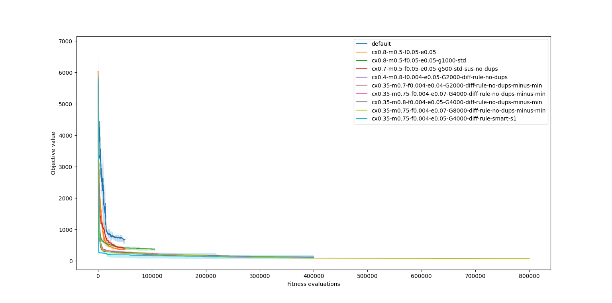
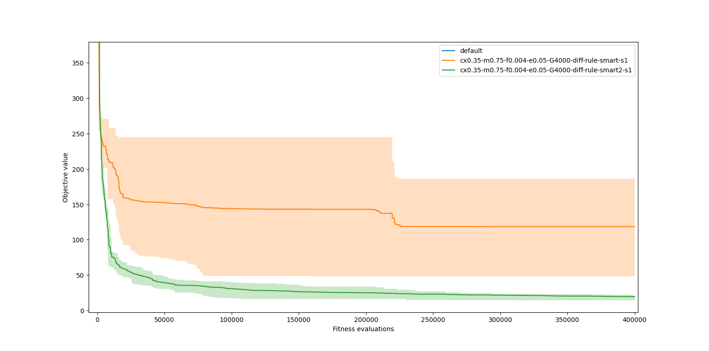
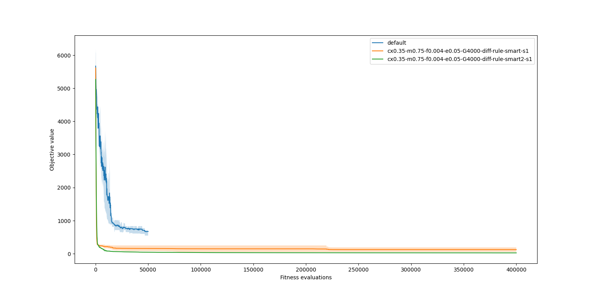

# HW 2 - Partition problem
Author: **Roman Kaňa**

## Part 1

### Task 1

*Experiment with the fitness and selection and try to solve the partition problem as well as you can. Try at lest two different things.*

I started with the `cross-over` prob. at `0.7` and `mutation` rate `0.5` and `flip` probability `0.05`. Since the high cross-over rate is not beneficial for finding the optimal solution I also introduced elitism using a `HallofFame` object using `5%` of population as an eilte with insertion without duplicates (avoiding adding an individual that is already in a population).
While also substracting the minimum value from the fitnesses in the `roulette_wheel_selection` so the worst individual has `0` probability of being selected.

Other attempts were to use the `tournament` selection and `stochastic universal/uniform sampling` other fitness functions like the `1 over standard deviation`.

But the best results were achieved with the `0.75` mutation rate and `2/IND_LEN` flip probability and cross-over rate at `0.35`. While using the original fitness and `updated rulette` selection.
I also had to increase the number of generations from `500` to `8000` to actually get the sub 50 objective score.

### Task 2

*Compare your variants with the basic one in the source codes and submit the plot and a short commentary.*

Description is above and the plots are below.

Higher cross-over probability should be beneficial in the early generations, but later on it can loose the good individuals.
The mutation rate should be atleast `0.5` to be able to explore the space of solutions well enough.
The flip is best to set to `2/IND_LEN` to have a good chance of flipping `2 bits` in each individual on average. So the swap of items is more likely to happen from heavy pile to ligher pile.

*Early runs / Later runs / All runs:*





### Task 3

*Put the lowest difference you found directly in the text of the submission and attach the .best with the best solution. I am interested in the one best solution you found, it can be from one lucky run.*

Name of the best solution is `cx0.35-m0.75-f0.004-e0.07-G8000-diff-rule-no-dups-minus-min`.

The best individual had a difference of `42` (taken from the `objective` file)

### Bonus

Should be in the `.best` file.

## Part 2

### Task 1

*Create an informed mutation operator and compare the results with those from last time.*

```python
def smart_swap_mutate(p, swaps, weights, fit_fnc):
    ind = p[:]
    bw = bin_weights(weights, ind)
    best_fit = fit_fnc(p)
    for _ in range(swaps):
        max_w, max_i = max(tmp_list := list(zip(bw, range(len(bw)))), key=lambda x: x[0])
        min_w, min_i = min(tmp_list, key=lambda x: x[0])
        optimal_item_weight = (max_w - min_w)/2

        max_idx = (i for i in range(len(ind)) if ind[i] == max_i)
        min_idx = (i for i in range(len(ind)) if ind[i] == min_i)
        best_fit_i = min(list(max_idx), key=lambda x: abs(weights[x] - optimal_item_weight))

        bw[max_i] -= weights[best_fit_i]
        bw[min_i] += weights[best_fit_i]
        ind[best_fit_i] = min_i
```

This as showen in the graphs below. This operator converges faster, but then suddenly plateaus. Some runs ended with sub 50 objective score, but others did sometimes ubruptly stoped improving for the rest of the run. This might be due to the operator being deterministic and not random.




A good solution might be to choose the the target pile index based on distance of the target pile weight to the item's original pile (bigger distance -> bigger chance) using the `random.choises(target_pile_indices, p=probs)`.

```python
def random_smart_swap_mutate(p, swaps, weights):
    ind = p[:]
    bw = bin_weights(weights, ind)
    for _ in range(swaps):
        max_i = max(pile_indicies := list(range(len(bw))), key=lambda x: bw[x])
        max_idx = (i for i in range(len(ind)) if ind[i] == max_i)
        
        probs = [abs(bw[i] - bw[max_i]) for i in pile_indicies]
        selected_pile_index = random.choices(pile_indicies, probs)[0]
        selected_item_index = random.choices(list(max_idx))[0]

        bw[max_i]               -= weights[selected_item_index]
        bw[selected_pile_index] += weights[selected_item_index]

        ind[selected_item_index] = selected_pile_index
    return ind
```
This second iteration of the operator is seems more consistant and expores the space of solutions better while still using the specific information about about the piles for faster convergence.

Usually gets under `50` within the first `1000` generations and then slowly converges to the circa `10`.

Comparison with the previous smart operator:
Close up / Full view:




### Task 2

*Write a short text about what you tried, how it worked and submit a plot showing the difference.*

This document. :) Sorry for its length.