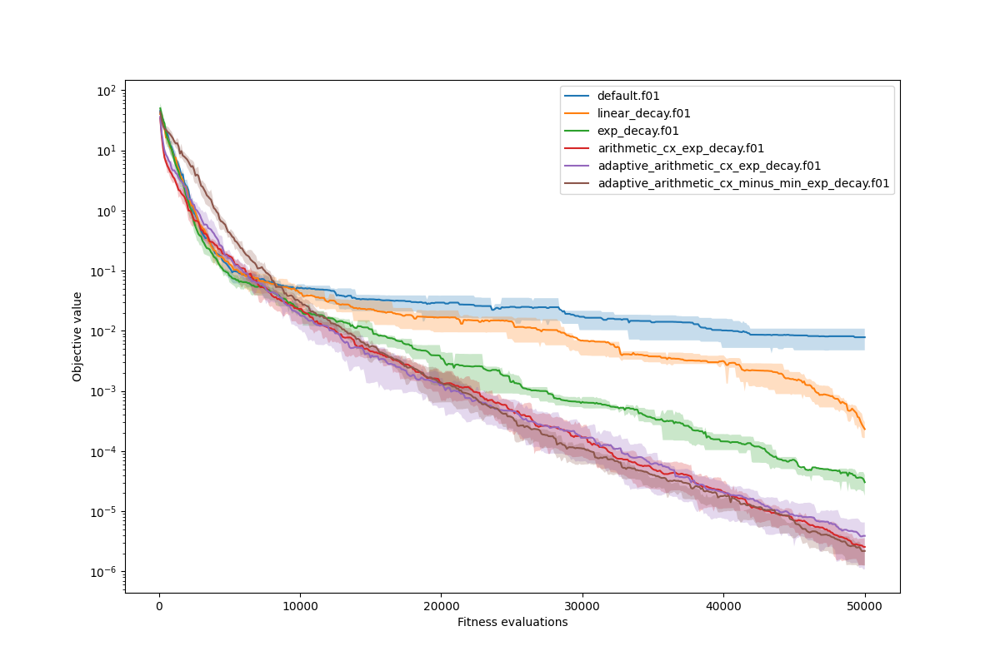
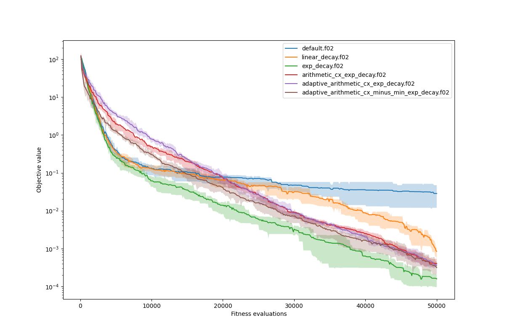
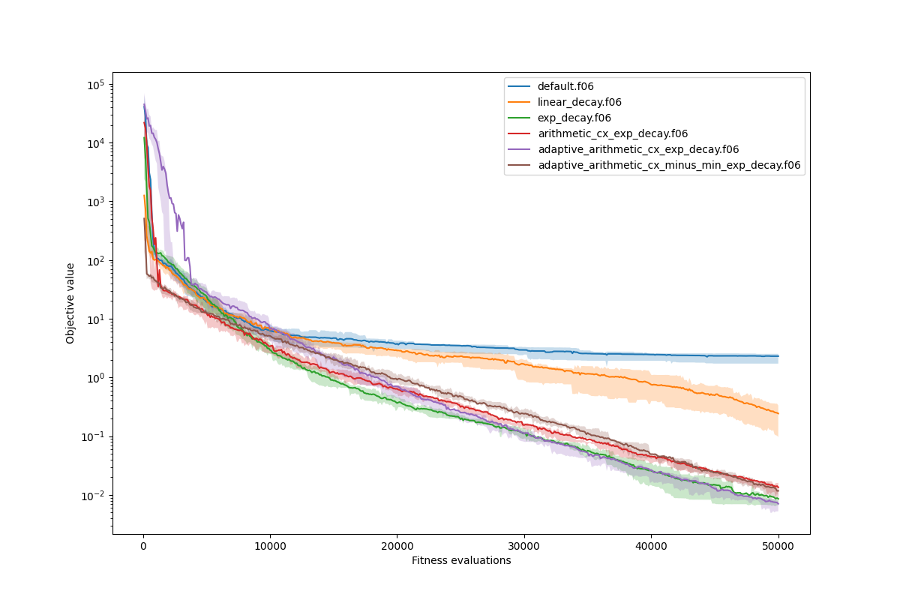
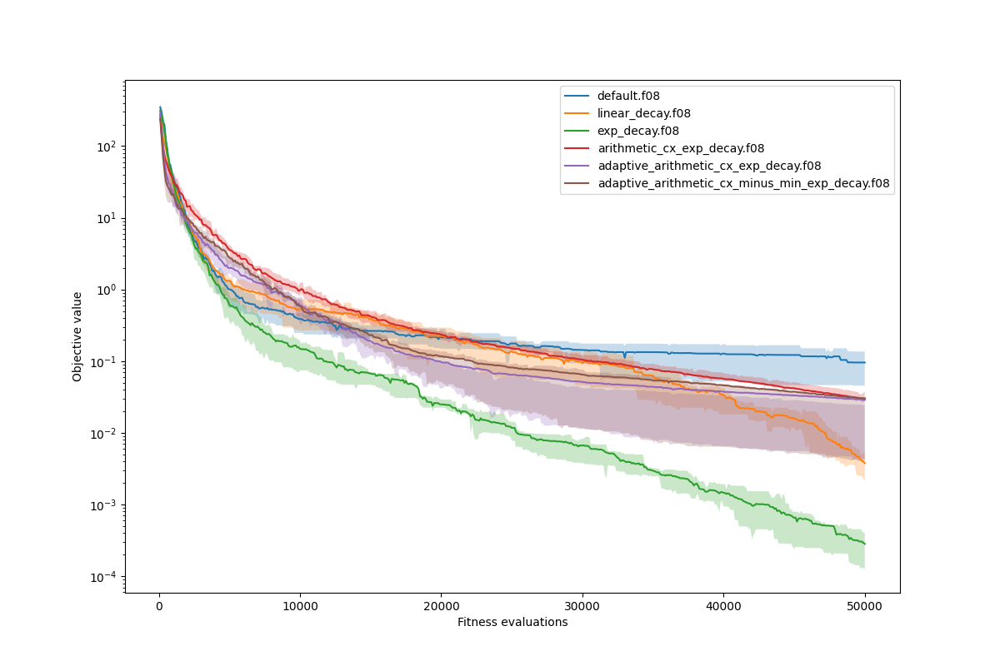
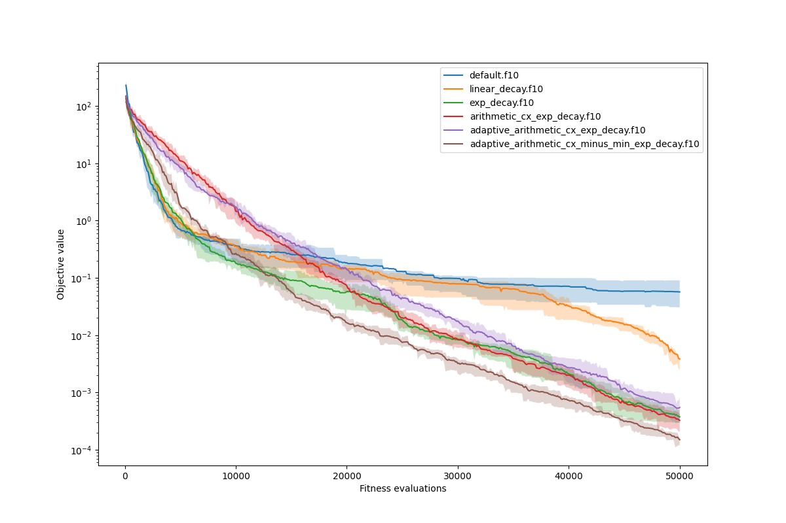
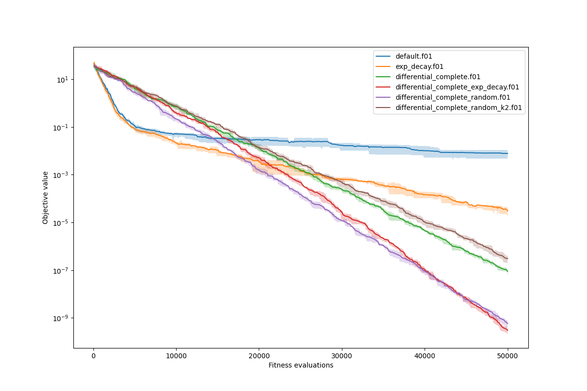
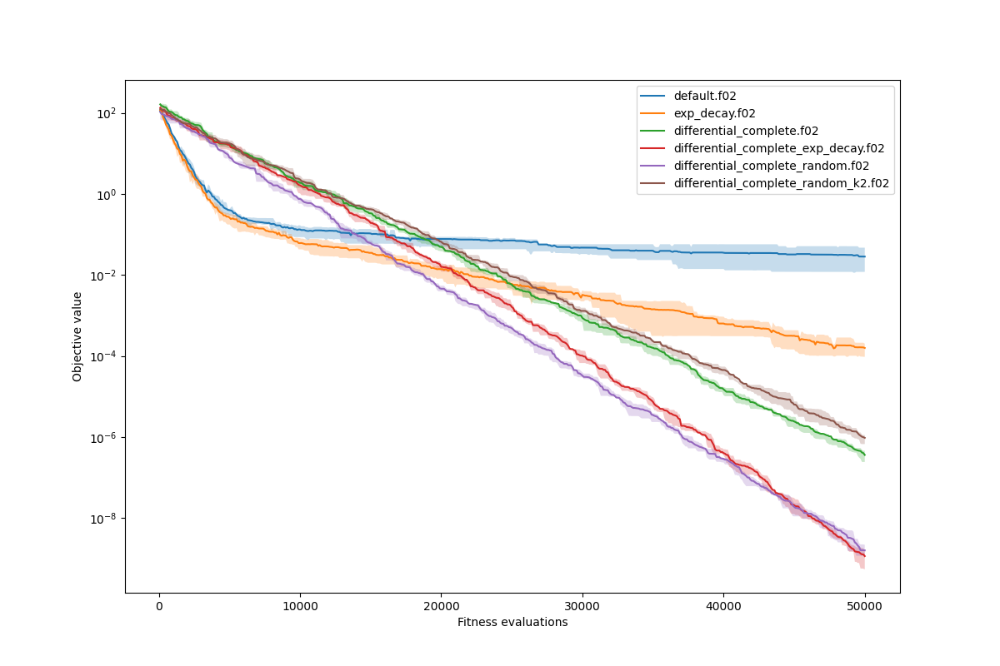
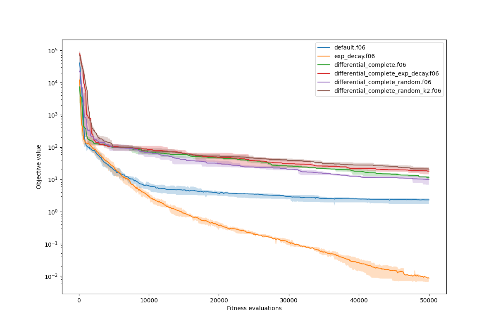
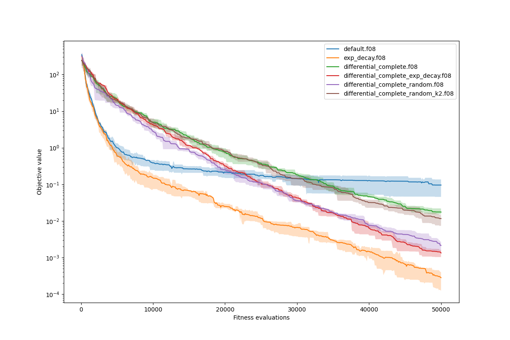
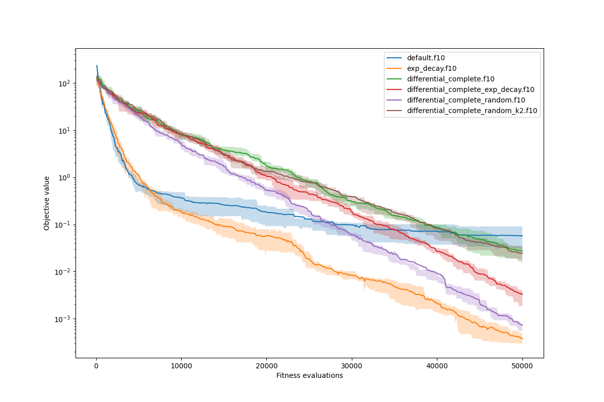

# HW 3 - Continuous optimization
Author: **Roman Kaňa**

## Part 1 - adaptive operators

### Task 1

*Create your own genetic operators (at least one adaptive) for continuous optimization and compare them to the default settings. You do not have to use all the functions from the BBOB benchmark. Select 4-5 of them from different groups.*

- Selected functions: the five functions that are already in the template code. *(f01, f02, f06, f08, f10)*

For adaptive operators, I have used your implemenation of the `Mutation` class and changes its `step_size` member according to the following scalers/schedulers (their implementations follows later):
- Linear scaling: from 0.5 to 0.01
- Exponential scaling (decay): from 0.5 to 0.01

```python
def linear_scaling(current, min_value, max_value, start_value=0.5, end_value=0.01):
    ratio = (current - min_value) / (max_value - min_value)
    return start_value + ratio*(end_value - start_value)

def exp_decay(current, min_value, max_value, start_value=0.5, end_value=0.01):
    ratio = (current - min_value) / (max_value - min_value)
    return start_value * (end_value/start_value)**ratio
.
.
.
    # used in the following way in the `evolutionary_algorithm` function
    mutate_ind.step_size = linear_scaling(G, 0, max_gen, MUT_STEP, MUT_STEP_FINAL)
    or
    mutate_ind.step_size = exp_decay(G, 0, max_gen, MUT_STEP, MUT_STEP_FINAL)
```

I also tried to create the weighted arithmetic crossover operator, but I was not able to make it work properly, beacuse I wanted it to be calculate the weights base the selected individuals fitnesses. I have tried to implement it in the following way as a class similar to the `Mutation` class:

```python
class ArithmeticCrossover:
    def __init__(self, f1=1, f2=1, fitnesses=None):
        self.f1 = f1
        self.f2 = f2
        
        self.fitnesses = fitnesses
        self.counter = 0
        
    @staticmethod
    def arithmetic_cross(p1, p2, f1=1, f2=1):
        w1, w2 = f1/(f1+f2), f2/(f1+f2)
        assert abs(1 - (w1 + w2)) < 1e-5, f'w1 + w2 = {w1 + w2}; should add up to 1'

        o1 = (w1*p1 + w2*p2)
        o2 = (w1*p2 + w2*p1)
        return o1, o2 

    def __call__(self, p1, p2):
        if self.fitnesses is None:
            f1, f2 = self.f1, self.f2
        else:
            f1, f2 = self.fitnesses[self.counter*2], self.fitnesses[self.counter*2+1]
            self.counter += 1

        return ArithmeticCrossover.arithmetic_cross(p1, p2, f1, f2)
```

I also tried to use the adaptivity of this class by setting the bigger weight for the better individual, but the results were not as good as I expected. I would have to spend more time on rewriting the code than the experiment would be running so I decided to scrap that.

The results of the experiments are in the following graphs (the Y-axis is scaled logarithmically):







I decided to use the exponential decay to scale the mutation step size to not overshoot the optimum as much as with the constant step size. The linear scaling was just fast and easy to implement so i tried it.

The arithmetic crossover operator should work well for convex functions (sphere and somewhat on elipsoids), but it does not work well for the non-convex functions (Rosenbrock, except for the minus min case). The results are worse than with the default operators.

> Note: I just used the default settings so there was just a comparison between the default and the adaptive operators.

## Part 2 - differential evolution
*Try to implement your own operators inspired by differential evolution. You have several options (choose some of them, or create your own). Compare the algorithms again on a set of function from the BBOB benchmark, select both separable and non-separable functions.*

Selected functions:
- Separable: f01, f02
- Non-separable: f06, f08, f10
- 
Atleast I think they are separable and non-separable, so the original function selection should be OK. 

### Task 1 
*Implement the differential evolution directly.*

Done using these functions and edit in the `evolutionary_algorithm` function:

```python
def get_donor(pop, ind, k):
    selected_idx = np.random.choice(len(pop), k*2+1, replace=False)
    base = selected_idx[-1]
    selected = np.array([pop[i] for i in selected_idx[:-1]])
    diffs = selected[0::2] - selected[1::2]
    direction = np.sum(diffs, axis=0)
    return pop[base] + direction

def diff_cx(donor, ind, cr_prob):
    ind = ind[:]
    for i in range(len(ind)):
        if random.random() < cr_prob:
            ind[i] = donor[i]
    return ind

def diff_sel(original, candidate, original_fit, candidate_fit):
    if original_fit > candidate_fit:
        return original
    else:
        return candidate

...

def evolutionary_algorithm(pop, max_gen, fitness, operators, mate_sel, cross_ind, mutate_ind, *, map_fn=map, log=None):
    evals = 0
    for G in range(max_gen):
        fits_objs = list(map_fn(fitness, pop))
        evals += len(pop)
        if log:
            log.add_gen(fits_objs, evals)
        fits = [f.fitness for f in fits_objs]
        objs = [f.objective for f in fits_objs]

        make_donors = functools.partial(get_donor, pop, k=1)
        donors = list(map_fn(make_donors, pop))

        cx_ind = functools.partial(diff_cx, cr_prob=CR_PROB)
        candidates = list(map_fn(cx_ind, pop, donors))
        candidiate_fits_obj = list(map_fn(fitness, candidates))
        candidates_fits = [f.fitness for f in candidiate_fits_obj]

        offspring = list(map_fn(diff_sel, pop, candidates, fits, candidates_fits))
        pop = offspring[:]

    return pop
```

F or step size is currently set to 1 and CR is set to 0.9. 
It would be interesting to see how would the DE behave with exp_decay or random sample from [0.5, 1] range.
The results are in the following graphs bellow:


### Task 2
*Try to use more than two individuals in the differential mutation.*

I will just use `k` pairs of individuals for the mutation. The base results are for `k=1` so it corredponds to `y = x1 + f*(x2 - x3)` and `k=2` would correspond to `y = x1 + f*(x2 - x3 + x4 - x5)` and so on, but that can be seen from the code above (*get_donor* function).

Most of the graphs are using `k=1`, but the last one is using `k=2` (suffix `k2`).
I dont know why but using more than 1 pair of individuals for the mutation does not seem to work well even though it should be more robust.

### Task 3 
*Try to change the parameters F and CR in an adaptive manner (or randomly).*

As I said befor It would be interesting to see how would the DE behave with exp_decay or random sample from [0.5, 1] range.

Both of these ideas seem to work well, but the random sampling seems to work better just a little bit.

The results are in the following graphs bellow:








## Part 3 - Lamarckism and Baldwinism
*Implement lamarckian and baldwinian evolution. You can use any local search method (e.g. simulated annealing), it does not have to be gradient-based and ompare both Lamarck and Baldwin to your methods from the previous parts.*

Could not make this in time unfortunately, sorry.