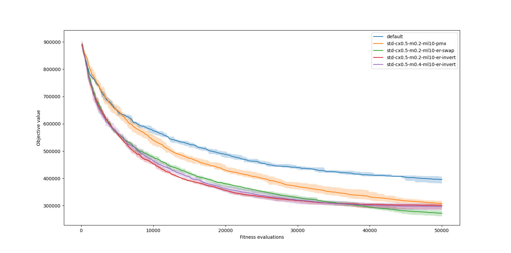
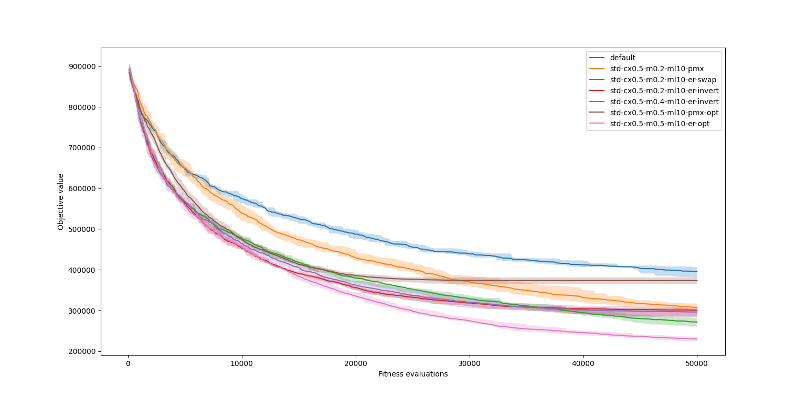

# Traveling Salesman Problem (TSP)
Author: Roman Kana


## Part 1
### Task
Experiment with the traveling salesman problem and try implementing some of the crossovers mentioned in the lecture. You can also try to change the mutation to the inverting one, or try changing the fitness function.

I have implemented the following crossovers:
- PMX - worked better than OX, was easier to implement, idea: keep a part of the good individuals and the mapping should work better then in OX
```python
def pmx_cross(p1, p2):
    def use_mapping(value, mapping):
        return mapping[value] if value in mapping.keys() else value

    def create_mapping(p1, p2):
        result_map = {}
        helper_map = {p1[i]: p2[i] for i in range(len(p1))}
        for i, n in enumerate(p1):
            # identical values
            if p1[i] == p2[i]:
                continue

            # mapping propagation
            local_n = n
            visited = set()
            while local_n in helper_map.keys():
                # cycle detected
                if local_n in visited:
                    break
                visited.add(local_n)

                local_n = helper_map[local_n]

            else:
                result_map[n] = local_n
                continue
                
        return result_map

    point1 = random.randrange(1, len(p1))
    point2 = random.randrange(1, len(p1))
    start = min(point1, point2)
    end = max(point1, point2)

    # swap the middle parts
    p1mid = p1[start:end]
    p2mid = p2[start:end]
    o1mid = p2mid
    o2mid = p1mid

    p1p2_map = create_mapping(p1mid, p2mid)
    p2p1_map = create_mapping(p2mid, p1mid)
    o1_use_mapping = functools.partial(use_mapping, mapping=p2p1_map)
    o2_use_mapping = functools.partial(use_mapping, mapping=p1p2_map)

    o1 = list(map(o1_use_mapping, p1[:start])) + o1mid + list(map(o1_use_mapping, p1[end:]))
    o2 = list(map(o2_use_mapping, p2[:start])) + o2mid + list(map(o2_use_mapping, p2[end:]))
    assert len(o1) == len(p1)
    assert len(np.unique(o1)) == len(o1) 
    assert len(np.unique(o2)) == len(o2) 

    return o1, o2
```
- ER - worked better than PMX, idea : good individuals should have better distances between cities => keeping these distances should be beneficial for the offspring, btw i dont agree with my implementation
```python
def edge_recombination(p1, p2):
    def get_neighbors(n, container=set):
        result = []
        for ind in [p1, p2]:
            index = ind.index(n)
            off_range = [-1, 1] if index != len(p1) - 1 else [-1, -len(p1) + 1]
            result.extend([ind[index + offset] for offset in off_range])
        return container(result)

    def update_neighbor_map(n_to_remove):
        if n_to_remove not in neighbor_map.keys():
            return
        neighbor_map.pop(n_to_remove)
        to_remove = set()
        for k, v in neighbor_map.items():
            if n_to_remove in v:
                neighbor_map[k].remove(n_to_remove)
            if len(v) == 0:
                to_remove.add(k)

        for k in to_remove:
            neighbor_map.pop(k)
    
    def get_mins(neighbor_map:dict, current=None):
        if len(neighbor_map) == 0:
            return []
        if current is not None and current in neighbor_map.keys():
            neighbor_map = {k: v for k, v in neighbor_map.items() if k in neighbor_map[current]}
        min_length = min([len(v) for _, v in neighbor_map.items()])
        return [k for k, v in neighbor_map.items() if len(v) == min_length]

    neighbor_map = {p1[i]: get_neighbors(p1[i], container=set) for i in range(len(p1))}

    result = []
    key = None
    while len(neighbor_map) > 0:
        if key is None:
            min_keys = get_mins(neighbor_map, key)
        key = min_keys[0] if len(min_keys) == 1 else random.choice(min_keys)
        result.append(key) 
        min_keys = get_mins(neighbor_map, key)
        if len(neighbor_map) > 0:
            update_neighbor_map(key)

    if len(result) < len(p1):
        rest = [i for i in p1 if i not in result]

    result += rest

    assert len(np.unique(result)) == len(result)
    assert len(result) == len(p1)

    return result, swap_mutate(result, MUT_MAX_LEN)
```
> Note: I cheated a bit and did not call `edge_recombination` twice but instead called `swap_mutate` on the result of the first call. I did this so it would return two individuals, and the edge recombination function seemed too slow to call it twice. I hope this is not a big problem.


I also tried other mutations, like:
- 2-opt : described in the [section Part 2](#part-2) using the `invert_mutate` function
- invert : using the 2-opt mutation function; can be seen in the section below
```python
def invert_mutate(p, max_len):
    source = random.randrange(1, len(p) - 1)
    lenght = random.randrange(1, min(max_len, len(p) - source))

    o = p[:]
    o[source:source+lenght] = o[source:source+lenght][::-1]

    return  o
```



> Note: It is interensting to se that the invert mutation had the same/similar performance even with double the mutation probability.


## Part 2
### Task
Try to use some of the informed operators and improve your solution from the first part. You can also try some improved initialization, or other tricks to improve the solutions. Send me a comparison of your solutions from both parts.

As an informed operator, I have implemented the 2-opt mutation:
```python
def opt_mutate(p, max_len, fit_fnc=None):
    o = invert_mutate(p, max_len)

    if random.random() < 0.1:
        return o

    return p[:] if fit_fnc is not None and fit_fnc(o).fitness < fit_fnc(p).fitness else o
```

Usually this caused the algorithm to converge faster, but always got stuck in some local optimum and stopped improving. So I added just a little bit of randomness to the mutation, so it returns the offspring even if it is worse than the parent with a probability of `0.1`.

I also increased the mutation probability since the 2-opt mutation is not as destructive as the swap or invert mutation.




## Bonus

Best attempt on the `tsp_std.in` input file as around `165 500 km` in the file `std-cx0.5-m0.5-ml10-er-opt-long_9.best` after 4000 generations. And I think I could get under `160 000 km` with more generations (something like 8000 i guess) but, I dont want to submit it too late. The shown graphs were only for 500 generations for quicker comparison.

### Task 1
On the input `tsp_std.in` find a path shorter than `170 000 km` (the optimum is around `158 418 km`).
### Task 2
On the input `tsp_std.in` find a path shorter than `160 000 km`.